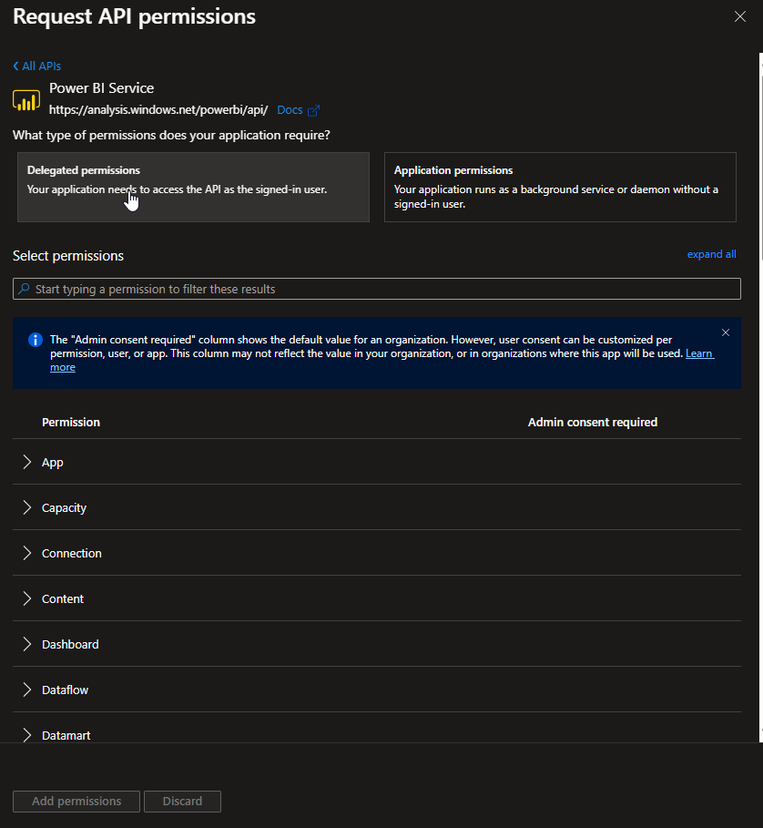
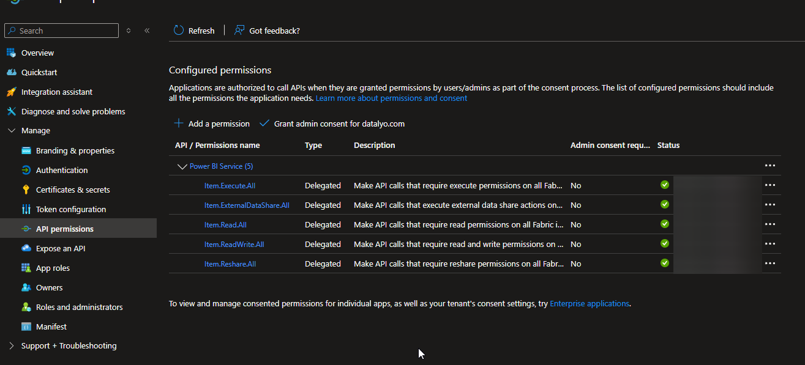
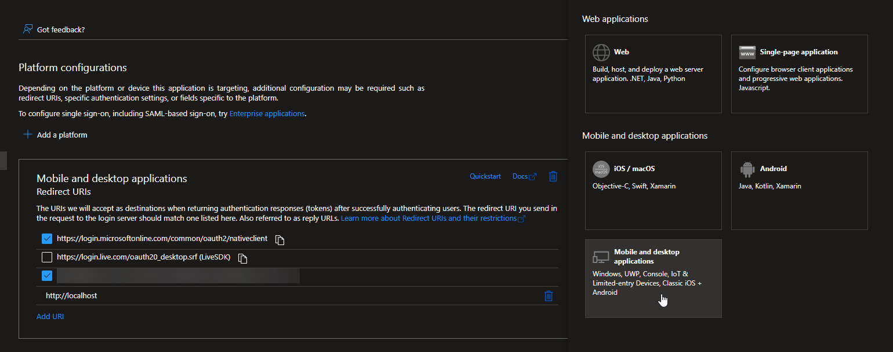
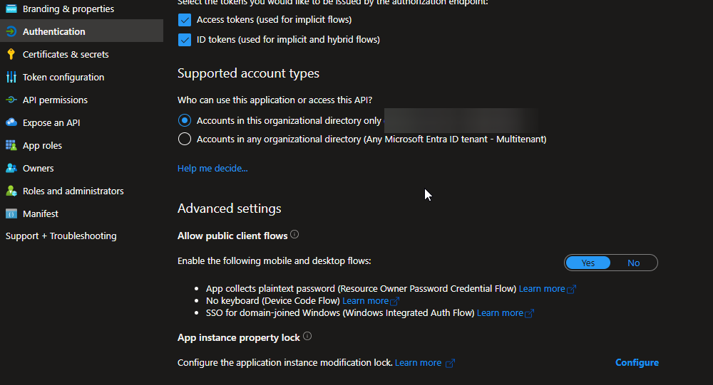
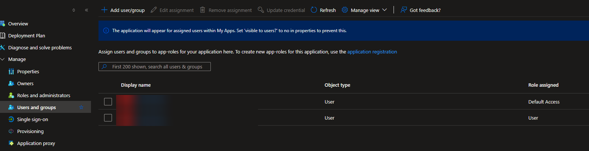

# Fabric API Samples

This project contains sample codes for managing Fabric using its REST API. You can find code examples for various operations such as creating lakhouse, warehouse or notebooks, managing security, or commiting to Git.

To get started, make sure you have the necessary dependencies installed and the Fabric API endpoint configured. Then, you can use the provided Python scripts (other frameworks will come later on) to interact with the Fabric API.

In order to use the Fabric API, you need to authenticate using an EntraID Application.
> Most of the items manageable by the Fabric API currently only allow for user based authentication, service principal support to come, as such the authentication works using an interactive flow.

## Creating and Configuring an Azure AD App Registration

To create and configure an Azure AD App Registration for your EntradaID application, follow these steps:
1. The basic configuration found in MS Docs: [Create a Microsoft Entra ID app](https://learn.microsoft.com/en-us/rest/api/fabric/articles/get-started/create-entra-app)
2. Add the required permissions (as needed)to the app registration: 
    
    
3. In order to be able to use the interactive flow, in the Authentication Pane you need to configure the Redirect URIs and allow public client flows:
    - Add a new Redirect URI: `http://localhost`
    
    - Allow public client flows:
    
4. Save the configuration and make note of the Application (client) ID and Directory (tenant) ID.
5. On the Entreprise Application Pane, make sure to add users allowed to use the application :
     


## Using the Fabric Lakehouse Script

To use the Fabric Lakehouse script: 

1. Clone the repository
2. Install the required dependencies
3. Update a .env file with the following information:
    ```bash
    CLIENT_ID=<Application (client) ID>
    TENANT_ID=<Directory (tenant) ID>
    ```
4. Run the script with the desired action and parameters:
    ```bash
    cd Python
    python lakehouse.py <action> <parameters>
    ```
>   If you have a doubt on the parameters, you can use the help command to get the list of available actions and their parameters:
    ```python lakehouse.py -h
    ```

